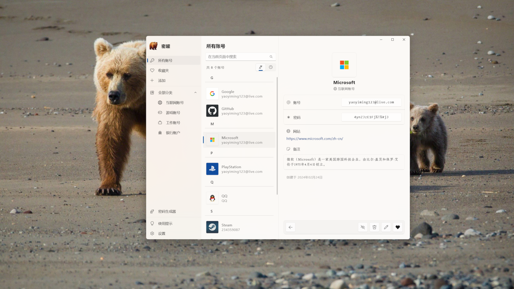

    

 

<h3 align="center">密罐，妥善保存蜜码</h3>

还在用纸质的小本子记录你的密码？快来试一下这个应用吧！身处网络时代，每个人手里都有十几个甚至几十个账号密码，眼花缭乱的账号难免会让人记混，这个简单的应用或许可以一定程度上缓解这种杂乱。

- 遵循 Windows 11 流畅设计体系
- 使用 Windows Hello 锁定您的应用
- 数据存放在本地，由你自己保管
- 密码生成工具，生成随机密码

