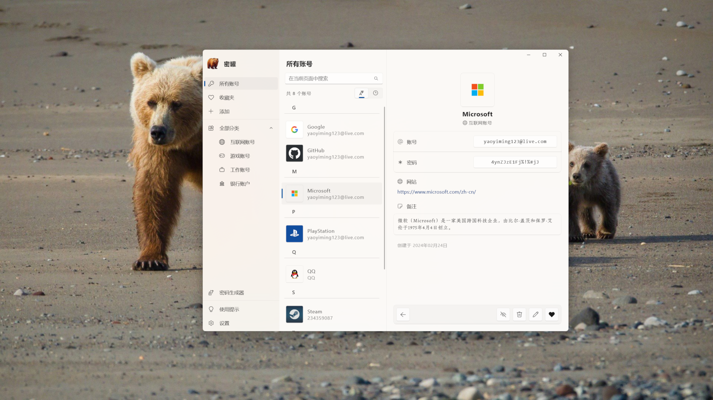

    

 

<h3 align="center">密罐，妥善保存蜜码</h3>
<h4 align="center">Honeypot, keep your sweet passwords safe and local</h4>

---

Still using a paper notebook to record your passwords? Try this app instead! In the digital age, everyone has a dozen or even dozens of passwords. Dazzling passwords will make people remember mixed, this simple application may be able to alleviate this clutter to some extent.

- Built with Windows 11 Fluent Design
- Secure your app with Windows Hello
- Your data stays local, under your control
- Password generator for strong, random passwords

> 还在用纸质的小本子记录你的密码？快来试一下这个应用吧！身处网络时代，每个人手里都有十几个甚至几十个账号密码，眼花缭乱的账号难免会让人记混，这个简单的应用或许可以一定程度上缓解这种杂乱。
> 
> - 遵循 Windows 11 流畅设计体系
> - 使用 Windows Hello 锁定您的应用
> - 数据存放在本地，由你自己保管
> - 密码生成工具，生成随机密码

#### TODO

- [ ] 支持 2FA 功能
- [ ] 增加类似 Microsoft Edge 的导出明文密码为 csv 文件的功能
- [ ] 增加支持导入来自浏览器的 csv 密码导出文件的功能

